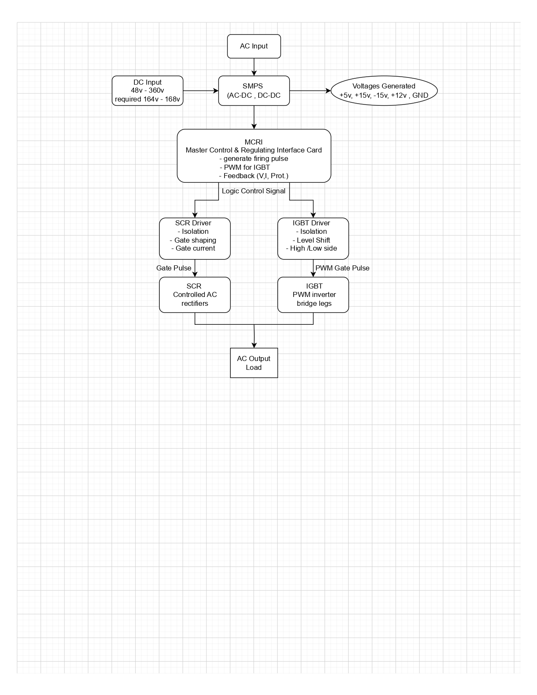
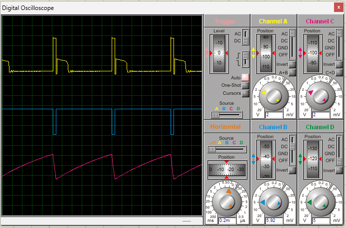

# Single Phase DC–AC Inverter – Internship Project

This repository documents the **system-level design and working principles**
of a **Single-Phase DC–AC Inverter** developed during my R&D internship.

All content in this repository is **non-confidential, conceptual, and learning-based**.
No proprietary schematics, firmware, PCB layouts, or company documents are included.

---

## Project Scope

- Single-phase DC–AC inverter architecture
- SCR-based controlled rectification
- IGBT-based PWM inverter stage
- Centralized control and regulation
- Gate drive isolation concepts
- Voltage and current feedback overview

---

## System Block Diagram

## Documentation

- [System Overview](docs/system_overview.md)
- [Inverter Working Principle](docs/inverter_working.md)

## Tools & Concepts

- Power electronics system design
- Block diagrams and SLDs
- PWM-based inverter control
- SCR and IGBT driver fundamentals
- SMPS-based auxiliary power generation

---

## Simulations

This repository includes **conceptual and educational simulations**
used to validate and understand the working principles of the
single-phase inverter system.

### Simulink Simulation
- Half-bridge DC–AC inverter topology
- Sinusoidal PWM (SPWM) based control
- Parameterized model using external MATLAB scripts
- Output voltage and current waveform analysis

📁 Location: `simulations/Simulink/`  
📄 Documentation: [Simulink Simulation README](simulations/Simulink/README.md)

### Scope and Limitations
- Ideal switches and control logic
- No dead-time or protection logic included
- Intended for learning and concept validation only

---

## Disclaimer

This repository contains **redrawn and simplified documentation**
created purely for educational and portfolio purposes.
It does **not** represent the complete industrial implementation.

---

## Author

Smit Gaikwad  
Electronics & Telecommunication Engineer
