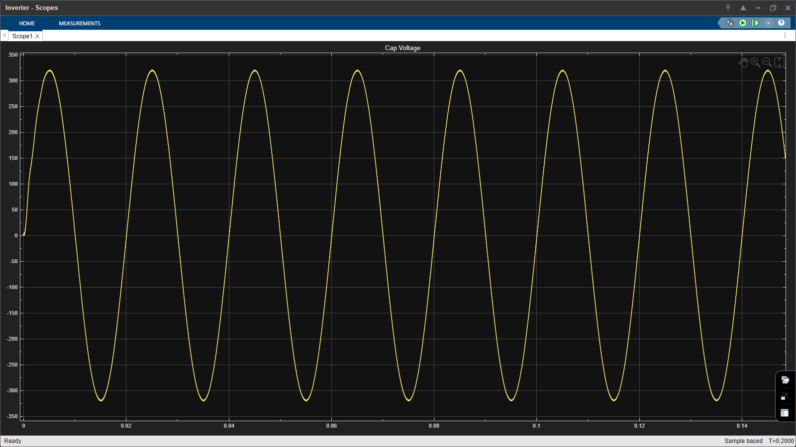
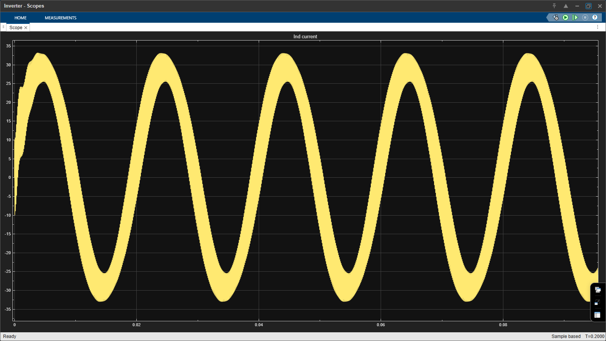

# Half-Bridge DC–AC Inverter – Simulink Simulation

This folder contains a MATLAB/Simulink-based simulation of a
single-phase **half-bridge DC–AC inverter** developed during an
R&D internship.

## Topology
- Half-bridge inverter using two IGBTs
- Split DC bus configuration
- Inductive load

## Control Strategy
- Sinusoidal PWM (SPWM)
- Fixed switching frequency
- Complementary gate signals for upper and lower switches

> Note: Dead-time is not included in this base model and will be added
> in subsequent refinement steps.

## Files
- `model/half_bridge_inverter.slx` – Main Simulink model
- `scripts/` – Parameter and initialization scripts
- `screenshots/` – Model and waveform images

## Purpose
This simulation is intended for conceptual understanding and
validation of inverter operation and control principles.
It is not a complete industrial implementation.

# Simulink Simulations

This folder contains conceptual and educational simulations used to
understand the working principles of power electronic systems.

The content is non-confidential and does not represent industrial or
proprietary designs.

## Scope
- Understanding switching behavior
- Observing gate pulse waveforms
- Verifying timing and pulse integrity
- Learning-based validation using simulation tools

## Simulink Model

## Simulation Results

### Output Voltage

### Output Current

