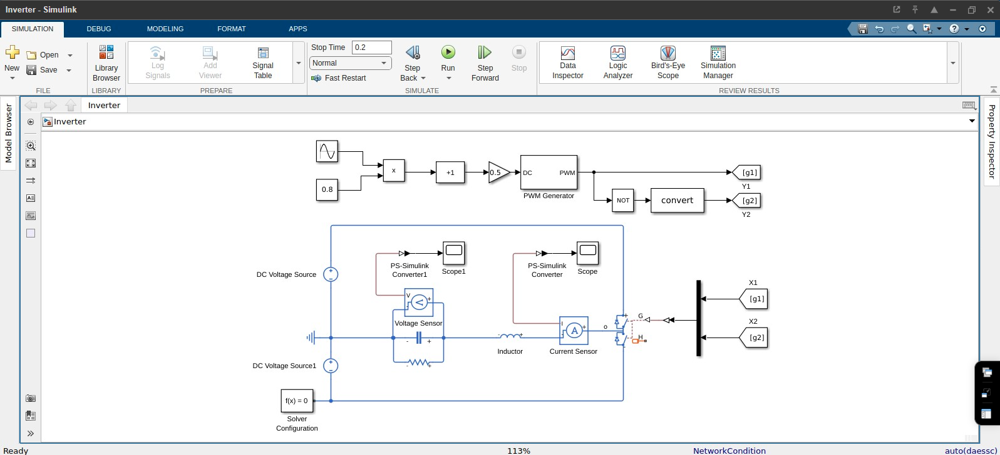

# Simulations

This folder contains **conceptual and educational simulations**
used to understand the working principles of power electronic systems.

The content is **non-confidential** and does not represent
industrial or proprietary designs.

## Scope
- Understanding switching behavior
- Observing gate pulse waveforms
- Verifying timing and pulse integrity
- Learning-based validation using simulation tools

- `Scripts/parameters.m` – Centralized electrical and control parameters
> The Simulink model is parameterized using an external MATLAB script
> to allow easy tuning of DC voltage, switching frequency, and load.

## Dead-Time Consideration

In practical half-bridge and full-bridge inverters, a small delay
(dead-time) is introduced between the turn-off of one switch and the
turn-on of its complementary switch.

### Purpose
- Prevents shoot-through of the DC bus
- Accounts for finite switch turn-off time
- Improves reliability of power devices

### Model Note
The current model uses ideal complementary gating for conceptual
clarity. Dead-time insertion will be added in a refined version of the
control logic.
